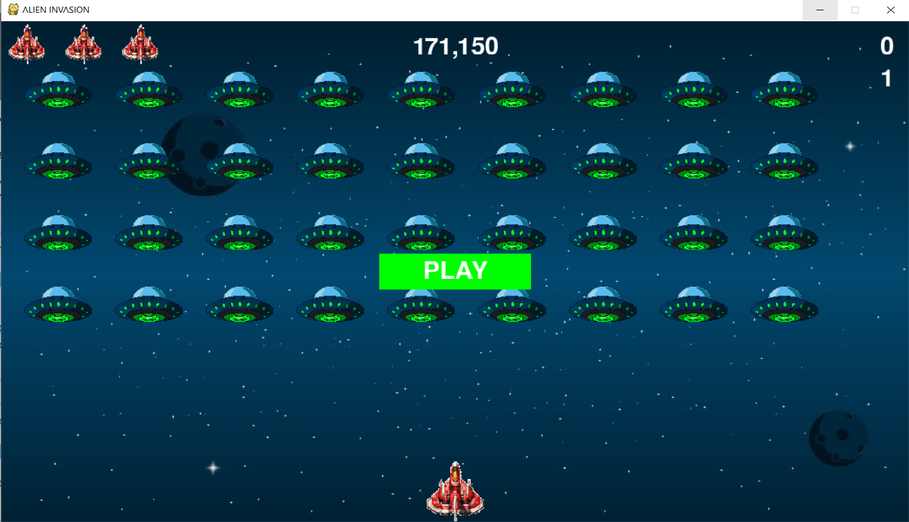

# Alien Invasion
This is a learning project of a simple 2D game "Alien Invasion" made
with Python3 and Pygame framework.

The goal of the game is to kill all aliens in the fleet before they reach the bottom of the screen or the player's ship.
When every alien in the fleet is shot down, level goes up and the game 
speed increases to a certain amount as well as the score the player gets
for every killed alien.
Simultaneously there can be only 3 bullets on the screen so that the game isn't too easy.

The game supports different statistics such as current score and level, high-score and 
number of lives the player has right now. All-time high score is stored
in a separate json file so that if doesn't reset every time you start a new game.

There are also sound effects when the player levels up and when loses a ship.
Besides, nice music plays in the background which adds to the atmosphere of the game.

- **Controls**:
    - Move your ship with left and right key arrows
    - Shoot bullets with spacebar
    - Start the game with either clicking on PLAY button or pressing Enter
    - Pressing P button pauses the game
    - Esc button exits the game

